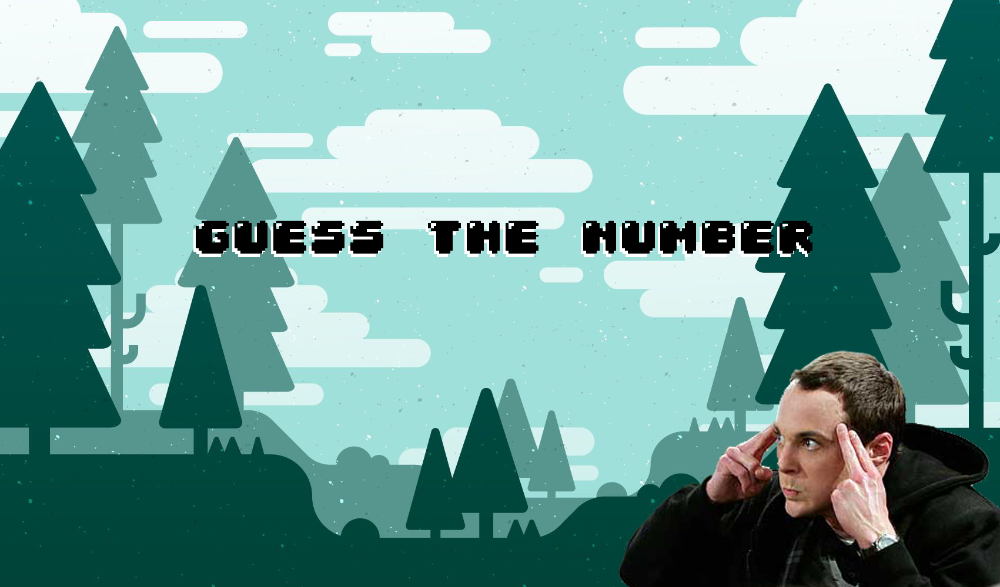

 
<h1 align="center">Guess The Number</h1>

<h3 align="center">
It's a guessing game, where you have 5 chances to get the number right.</h3>
<h3 align="center">
With voice recognition it identifies your speech and translates it into text, giving hints if the value is greater or less than the number you said.</h3>

 

 

<h1 align="center">technologies used 👨‍💻</h1>

[]
[]
[]

 

 

 

<h2 align="center">follow me on social networks:</h2>

 

